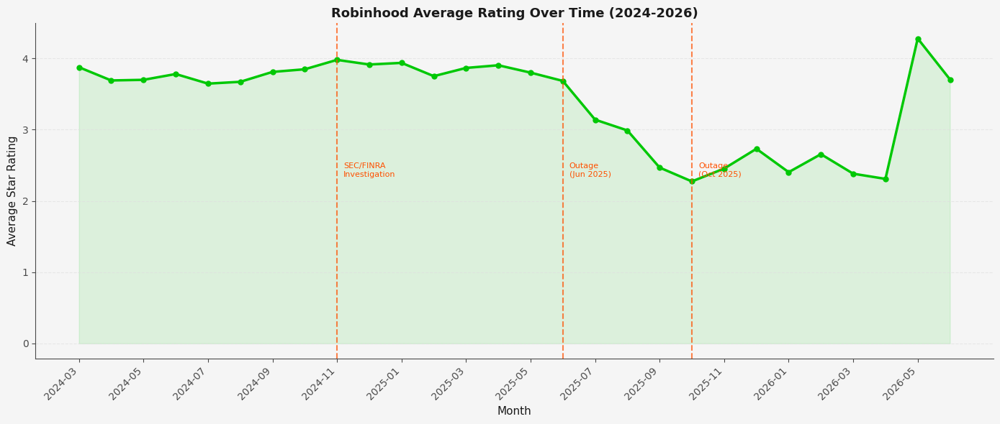
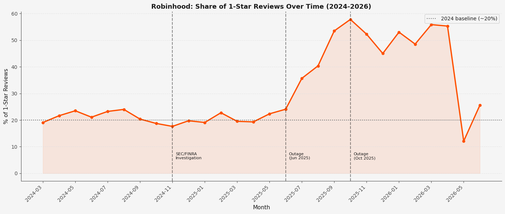
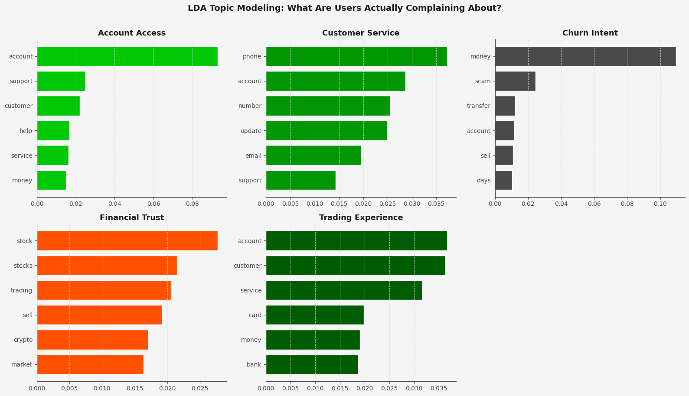
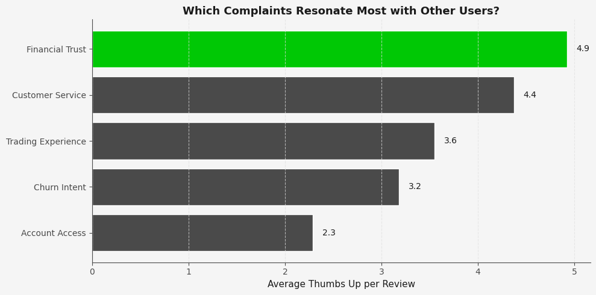
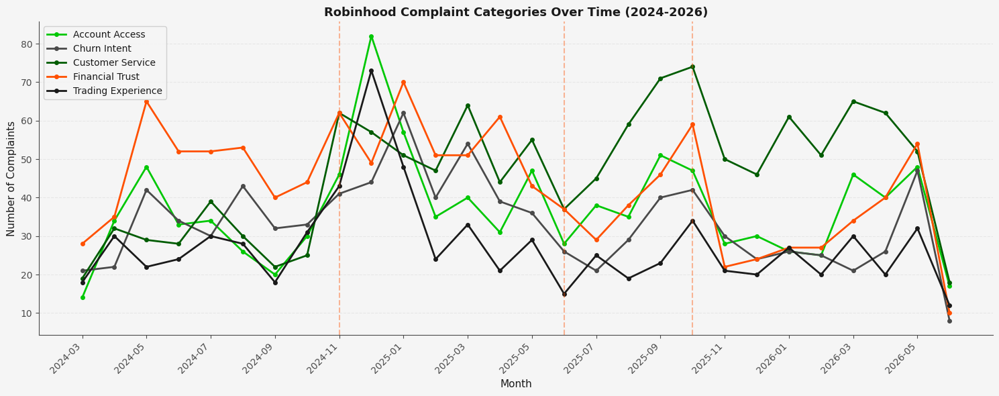
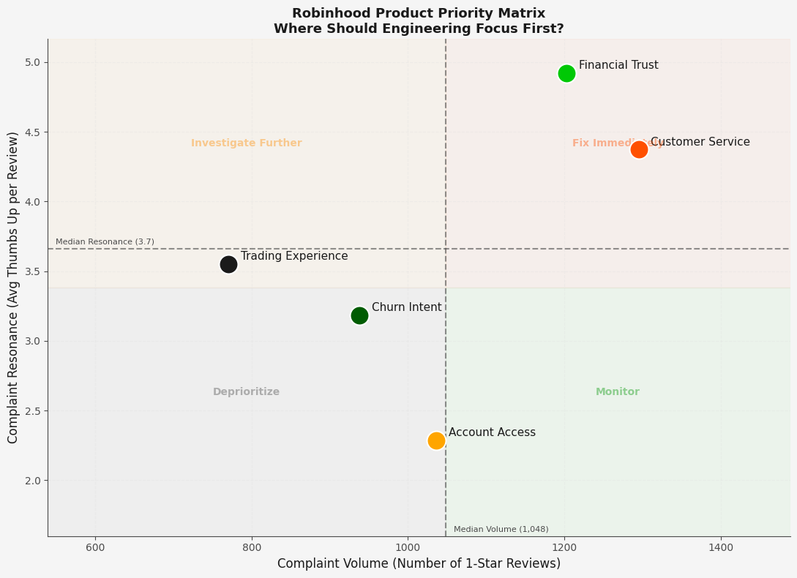

  
# Robinhood Product Case Study
### What 2 Years of User Reviews Reveal About a Platform in Crisis

---

## The Question

Robinhood has aggressively expanded beyond trading, launching Gold, retirement accounts, 
banking, and a credit card. Yet its Google Play rating sits at 3.65 with 1-star reviews 
comprising over 50% of monthly reviews since mid-2025.

**Are these new products changing what users complain about, or are the same problems 
persisting regardless of feature additions?**

---

> **TL;DR**
> Analyzed 21,000+ Robinhood Google Play reviews (2024-2026) using NLP and topic modeling.
> Found that two platform outages in 2025 drove 1-star reviews from 20% to 55% of all monthly
> reviews and never recovered. Trading Experience complaints generate 2x more community
> validation than any other category. Recommended rebuilding the order placement flow as a
> reliability-first experience targeting active traders.

---

## Hypothesis

Robinhood's platform reliability failures are the primary driver of trust collapse. Every 
failure directly costs users money during the moments they need the platform most. New 
product expansion is not addressing this core problem.

---

## Data and Method

| | |
|---|---|
| **Source** | Google Play Store via `google-play-scraper` |
| **Volume** | 21,000 reviews |
| **Date Range** | March 2024 to June 2026 |
| **Methods** | VADER sentiment scoring, LDA topic modeling (5 topics), thumbs-up weighted analysis, time-series trend analysis, competitor mention tracking |

> **Note on data sourcing:** Apple App Store API returned 401 errors, so Google Play is 
the primary source. iOS and Android behavior may differ slightly.

---

## Key Findings

### 1. Sentiment Collapsed in Mid-2025 and Never Recovered

Average ratings held stable around 3.8 to 4.0 through 2024 before dropping sharply in 
June 2025. Two confirmed platform outages explain the collapse:

- **June 13, 2025** — App outage during Israel-Iran market volatility. 70% of Downdetector 
  reports cited app failure, with users losing money on open positions.
- **October 6, 2025** — Second major outage. Sentiment bottomed out at 2.3/5.

Critically, sentiment never recovered between the two events, creating a compounding trust 
deficit rather than a temporary blip.

---

### 2. 1-Star Reviews More Than Doubled as a Proportion

1-star reviews went from a stable 20% baseline in 2024 to over 55% of all monthly reviews 
post-June 2025. This is a structural shift, not a volume artifact.

A late-2024 spike predates the outages entirely. This correlates with SEC/FINRA regulatory 
actions building in news coverage throughout Q4 2024, with a $45M penalty announced in 
January 2025.

**Three trust-damaging events in sequence:**
1. **Q4 2024** — SEC/FINRA regulatory scrutiny builds in public coverage
2. **June 2025** — App outage during high-volatility market event
3. **October 2025** — Second major outage; sentiment hits floor

---

### 3. Five Complaint Categories Identified via LDA Topic Modeling

Unsupervised LDA modeling on 5,244 negative reviews surfaced 5 statistically distinct 
complaint themes. No manual labeling involved — the algorithm found these groupings from 
the text alone.

| Topic | Label | Review Count |
|---|---|---|
| 0 | Account Access | 1,516 |
| 3 | Financial Trust | 1,398 |
| 4 | Trading Experience | 942 |
| 1 | Customer Service | 804 |
| 2 | Churn Intent | 584 |

Account Access and Financial Trust together account for **56% of all 1-star reviews**, 
confirming the core problem is users being locked out of their money, not just poor UX.

The word "scam" appearing in the Financial Trust cluster is significant. Users are not 
just frustrated — they feel deceived.

---

### 4. Trading Experience Is the Most Validated Complaint

Weighted by thumbs-up count, Trading Experience generates **6.4 average thumbs up per 
review** — more than double any other category. These are the most resonant complaints:

- *"App crashes during option simulated returns"* — 616 thumbs up
- *"Cannot put in any orders, keyboard does not come up"* — 530 thumbs up
- *"App sets you up for failure by deleting digits when updating order target"* — 442 thumbs up

Every top validated complaint involves **losing money because the app failed during a trade**.

---

### 5. Complaint Categories Over Time

Account Access complaints were stable through 2024 then surged after June 2025 and 
stayed elevated. Financial Trust spiked in late 2024 (regulatory news) then again 
after each outage. Trading Experience complaints are relatively lower in volume but 
consistently generate the highest community validation.

---

### 6. Users Are Leaving in Two Directions

Competitor mentions split between **Webull (110)** and **Fidelity (98)**, suggesting 
two distinct churning segments:

- Casual traders moving toward Webull (same demographic, gamified experience)
- Maturing investors moving toward Fidelity (traditional, serious platform)

Robinhood is being squeezed from both ends of its user base simultaneously.

---

### 7. Product Priority Matrix

Plotting complaint volume against resonance reveals a clear prioritization signal. 
Trading Experience sits in the Investigate Further quadrant — lower volume but highest 
community validation. Financial Trust and Customer Service land in Fix Immediately — 
high volume and high resonance. Account Access sits in Monitor despite being the 
highest-volume complaint category.

---

## The Finding

Robinhood's biggest problem is trust erosion driven by trading reliability failures. 
When the app crashes or malfunctions during order placement, users do not just get 
frustrated — they lose real money. This is the complaint that resonates most broadly, 
and it happens repeatedly during the exact moments of highest financial stakes.

New product expansion (Gold, banking, credit card) is not addressing this. It may be 
diluting engineering focus away from the core reliability problem.

---

## Product Recommendation

**Rebuild the order placement flow as a reliability-first experience.**

**Feature 1: Reliability Mode**
A stripped-down, gamification-free order interface that activates automatically during 
high-volatility market periods (detected via volume thresholds). No animations, no 
upsell prompts. Just the core order flow. Modeled after airline booking systems that 
simplify during peak load rather than crashing.

**Feature 2: Order Confirmation Safeguards**
Redesign order entry with explicit multi-step confirmation that prevents accidental 
submissions and digit deletion. Similar to how banking apps handle wire transfers — 
intentional friction at the moment of highest financial risk.

**Target user:** Active traders placing 5 or more trades per month. This is the segment 
most financially harmed by reliability failures and most likely to switch to Fidelity 
or Webull.

---

## Success Metrics

**Technical (measure immediately post-launch):**
- Order completion rate (% of users who start and successfully submit an order)
- App crash rate during order placement (target below 0.1%)
- Order abandonment rate during high-volatility periods

**Trust recovery (measure 60 to 90 days post-launch):**
- Day-30 retention among active traders
- 1-star review rate returns toward 2024 baseline (~20%)
- Trading Experience average thumbs-up decreases as complaints resolve

---

## Limitations and Next Steps

**Limitations:**
- VADER cannot detect sarcasm — inflated positive sentiment scores. Star ratings used 
  as primary signal throughout.
- Google Play only — iOS users may behave differently. App Store data would 
  strengthen findings.
- No demographic data — casual vs. active trader segments inferred from competitor 
  mentions, not directly measured.

**Next steps with more time:**
- NLP analysis on 5-star reviews to understand what is actually working
- A/B test design for the proposed order flow changes
- Reddit data (pending API approval) for richer qualitative signal
- Segment analysis by app version to tie complaints to specific releases

---

## Methodology Note

The original thesis focused on gamification backlash across 2020 to 2025. Data 
availability shifted the scope to 2024 to 2026, which revealed a more current and 
arguably more urgent story: Robinhood's expansion is happening on an unstable 
reliability foundation.

The thesis evolved based on evidence — not the other way around.

---

## Project Structure
